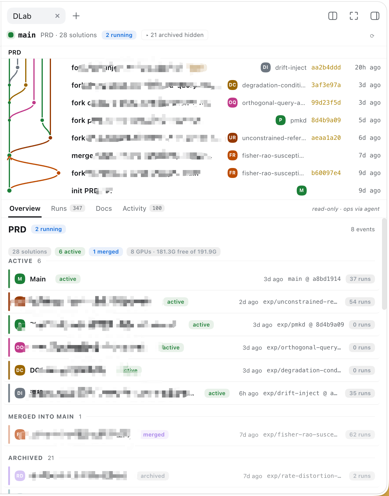
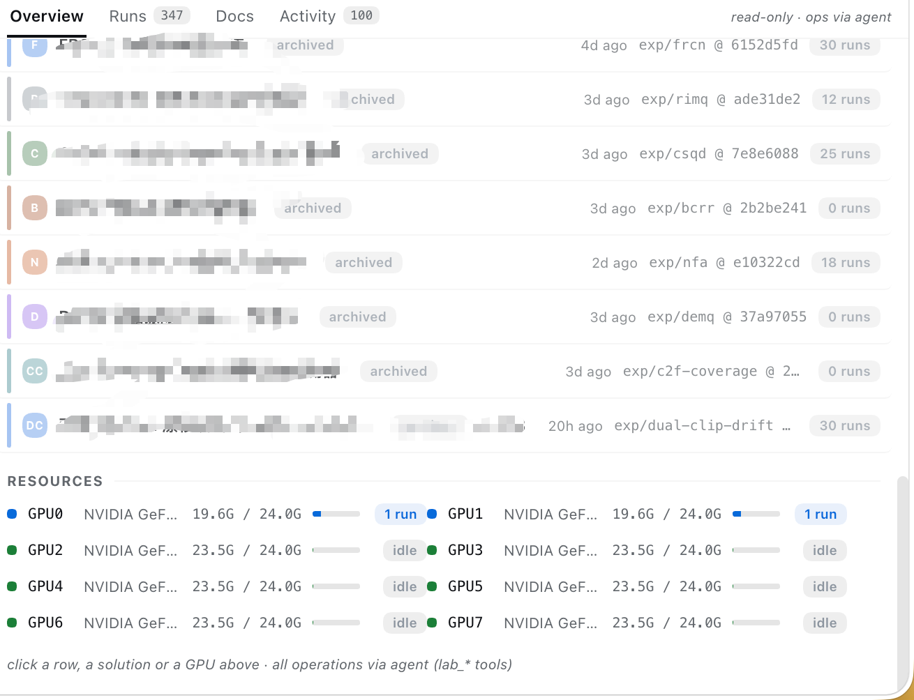

# dsh-lab — DSH 的深度学习实验室插件

> 一个 DSH 插件：让 Agent 在你当前项目里并行做深度学习实验。
>
> English version: [README.en.md](./README.en.md)





## 这是什么

`dlab-plugin` 是给 [DeepSeek Harness](https://github.com/deepseek-ai)（DSH）写的一个插件，把「做深度学习研究」——这些原本散落在 shell、git、tmux、conda、`nvidia-smi` 里的事情——整合成一个由 **Agent** + **只读 Web 面板**协作完成的工作流。

你用自然语言告诉 Agent「我想换一下 loss 看看」——Agent 会：

1. 在当前项目里 fork 一条新的 git branch（一条独立的 worktree）
2. 把你的修改提交成一次 checkpoint
3. 调度空闲的 GPU 跑训练
4. 训练过程被记为一次 Experiment run；一条 branch 上可以跑很多次
5. 训完看结果，结论好就合回 main，不好就封存成 archive

Web 面板（见上方两张截图）给你看「现在有几条 branch、每条上跑了几次、哪张 GPU 在用」，但**所有写操作都过 `lab_*` 工具**——面板本身只读。

适用：一台多卡的实验室 / 个人 GPU 服务器 / 一台机器 8 卡的人。
不适用：跨机多节点训练（调度器是单机设计的，多机需要扩展 scheduler）。

## 核心思路

- **方案（solution）= git worktree**。每条实验是 `main` 的一个 worktree，独立 branch、独立依赖锁，互不污染。
- **运行（run）= 子进程 + 日志**。每次训练 fork 一个 detached 进程，stdout 落到 run 目录里，断电也不丢。
- **证据门（evidence gate）**。合回 `main` 必须有过 succeeded 的训练结果，否则默认拒绝（带 `--allow-unevidenced` 显式 override）。半成品不上主干。
- **共享文档一次写**。`docs/` 在所有 solution 之间共享；worktree 里的 `docs/` 是软链接，永远不会变成多份过时副本。
- **GPU 排队而不是失败**。卡满就排队，等着新 run 自动接管释放出来的卡。
- **Agent 即接口**。面板只读，所有写操作都得通过 Agent 的 `lab_*` 工具，任何改动都过 DSH 的会话日志，可重建。

## 主要功能

| 功能 | 说明 |
| --- | --- |
| 分支生命周期面板 | 主面板上半部（左列轨道图 + 右列事件列表）。`init` / `fork` / `merge` / `archive` 用 git-style lane graph 可视化。 |
| 解决方案状态分类 | 主面板下半部 Overview：ACTIVE / MERGED INTO MAIN / ARCHIVED 三大类，每条 branch 显示状态、branch@commit、run 数。 |
| 多 GPU 资源视图 | RESOURCES 区显示当前机器所有 GPU（截图为 8× GeForce 24GB），每张显示已用 / 总量 + 占用方。点 GPU 行可过滤到该卡上的所有 run。 |
| 训练任务面板 | Runs tab（截图里 347 个 run）：按 solution 分组折叠，活跃 run 置顶，每条 run 显示提交时间、状态、GPU 占用、metrics。 |
| 文档视图 | Docs tab：项目共享文档 + 每个 solution 的私有 notes；选中 solution 后该 solution 的内容置顶。 |
| 活动流 | Activity tab：原始 event log，类型彩色点 + 名称（非 id），按时间倒序。 |
| Agent 操作面板 | 面板本身只读；所有操作通过 DSH 会话里的 `lab_*` 工具（`fork` / `checkpoint` / `archive` / `restore` / `merge` / `start_run` …）。 |

## 快速上手

1. **克隆并构建**：
   ```bash
   git clone https://github.com/zhjcreator/dlab-plugin.git
   cd dlab-plugin
   pnpm install
   pnpm build
   ```
2. **装到 DSH**：把 `dist-tb/` 里的 tarball 挂到你的 dsh profile 下并 `pnpm install`（详见「技术参考 / 初始化」）。
3. **装 preset**：`./scripts/install-preset.sh` 把 `dlab` 智能体套装复制到 `~/.dsh/.agent-presets/`。
4. **启动 DSH 并选 preset**：`dsh web`，在预设选择器里选「深度学习实验 / dlab」。
5. **开干**：在 DSH 里用自然语言告诉 Agent 你想试的实验想法。

## 实验项目组织结构

`dsh-lab init` 在你的项目根目录上跑过一次之后，目录长这样：

```
<project-root>/
├── .dsh-lab/                  # dlab 状态（不入 git）
│   ├── lab.sqlite             # 元数据库：solutions / runs / events / docs
│   ├── repo.git/              # 裸 git 仓；所有 branch 与 worktree 的源
│   └── run-worktrees/         # 每次 run 的快照 worktree
├── docs/                      # 共享文档（refs/dsh/docs 入库；symlink 进各 worktree）
│   ├── .dlab/                 # 自动生成的快照 + 索引（git-ignored）
│   └── local/<slug>/          # 各 solution 升上来的结论
├── solutions/                 # 主 + 实验的 worktree（每条 branch 一个目录）
│   ├── main/                  # main 分支的 worktree
│   └── exp-<slug>/            # 各 fork 出来的实验 worktree
├── experiments/               # 每次训练的输出
│   └── run-NNNNNN/
│       ├── logs/stdout.log    # 实时 stdout（job_output 也从这里读）
│       ├── logs/stderr.log
│       └── manifest.json      # 提交时的快照元数据：command、resources、environment fingerprint
└── <你的项目代码>/
```

关键设计点：

- **`.dsh-lab/repo.git` 是裸 git 仓**，不在你原项目根的 `.git/` 里。这样 dlab 引入的 branch / ref（`refs/dsh/docs`、`refs/dsh/runs/`）跟你的普通 git 历史完全隔离，不会污染你的 commit graph。
- **每条 solution = 一个 worktree**：worktree 之间共享 git 数据库但文件物理隔离，互不污染。
- **`docs/` 在所有 solution 之间共享一份**：每个 worktree 里的 `docs/` 是软链 → 共享根，永远不会变成多份过时副本。

## Solution 与 Run 的状态机

**Solution（一条实验分支）**：

| 状态 | 含义 |
| --- | --- |
| `active` | branch + worktree + DSH workspace 全在 |
| `merged` | 已合到另一条 solution；branch 保留，worktree 通常被移除 |
| `archived` | branch 保留，worktree 被移除，没有 DSH workspace |
| `broken` | DB 与 git/FS/registry 不一致，需要 `repair` |

**Run（一次训练提交）**：

```
queued ──▶ starting ──▶ running ──┬─▶ succeeded   (exit 0)
                                  ├─▶ failed      (exit ≠ 0)
                                  ├─▶ canceled    (SIGTERM / lab_stop_run / session 销毁)
                                  └─▶ lost        (进程死了但没拿到 exit code：OOM、kill -9、断电)
```

`queued → starting` 这一步在 GPU 分配之前划掉；一旦认领，每次退出都会留下一个确定状态。`lost` 严格指「曾经 spawn 过但死得没拿到 exit code」——「从未启动的种子」会被回收到队列而不是变成幻影 `lost`。

## 典型工作流

**场景**：你有一个训练脚本 `train.py`，想试试新的 loss。下面是从 DSH session 里实际发生的对话 + Agent 调用 + 系统反应的串联。每条都标了「用户 → Agent 调用 → 系统反应」。

### 1. 起步：看现在 lab 长什么样

```
你：现在 lab 里有几条 solution？
Agent：调 lab_status / lab_list_solutions
系统反应：Overview 面板 ACTIVE 区立刻更新；DETAILS 里的 count 与 last activity 实时刷新
```

### 2. 开一条新实验

```
你：试一下把 loss 换成 focal loss，名字用 exp-focal-cos
Agent：调 lab_fork_solution({ source: "main", slug: "exp-focal-cos" })
系统反应：
  - 文件系统：在 solutions/ 下新建 exp-focal-cos/（一份 main 的物理副本 worktree）
  - git：.dsh-lab/repo.git 里多出 exp/exp-focal-cos branch
  - DB：solutions 表插入一条 role=experiment status=active 的 row
  - 面板：主面板顶部 lane graph 画出一条新 lane（颜色按 fork 顺序）；右侧事件列表多一条 fork 记录；
    Overview 里 ACTIVE 区多一行
```

### 3. 改代码

```
你：把 train.py 里的 CrossEntropyLoss 换成 focal loss
Agent：在 solutions/exp-focal-cos/ 下用 fs 工具改 train.py（用户没要求 commit 之前，文件是 dirty）
系统反应：
  - 工作树脏了，但 branch 没动、run 不会受影响（run 是独立 worktree 的快照）
  - 面板：DETAILS 里"Changes vs main" chip 立刻更新（diff stat 实时）
```

### 4. 提交 checkpoint

```
你：commit 一下，message 写 "switch loss to focal, lr 1e-4"
Agent：调 lab_checkpoint_solution({ solution: "exp-focal-cos", message: "..." })
系统反应：
  - git：exp/exp-focal-cos branch 多一个 commit
  - DB：events 表多一条 solution_checkpointed
  - 面板：branch@commit 列从 main 后面跳到新 commit hash；DETAILS 的 facts 里 updated_at 刷新
```

### 5. 跑一次训练

```
你：跑一下，命令是 python train.py --config configs/a.yaml
Agent：调 lab_start_run({ solution: "exp-focal-cos", command: [...], gpuCount: 2 })
系统反应（按时间顺序）：
  1. DB：runs 表插入一行 status=queued
  2. 调度：scanner 找到一张 ≥2 张空卡的 GPU 集合；如果没空闲 GPU，状态停留在 queued（FIFO 排队）
  3. 拿到卡 → status 变 starting → 在 .dsh-lab/run-worktrees/run-NNNNNN/ 起快照 worktree
     （这是提交时刻的代码快照；你之后在 solutions/exp-focal-cos/ 里再改代码也不会影响这次 run）
  4. spawn detached 进程 → status=running，experiments/run-NNNNNN/logs/stdout.log 开始被 append
  5. GPU 在 RESOURCES 里从 idle 变 running；状态条变蓝色；占用方写成 run id
  6. Run 完成（exit 0）→ status=succeeded → 释放 GPU → 唤醒 DSH session（一次性 wakeup，不会逐次打扰）
面板：
  - Runs tab 多一行；solution 折叠组里置顶；右侧 metrics 块填上
  - Resources tab 那张卡的进度条回到 idle（如果没别的 run 占它）
```

Agent 在 `<work_id>` 那一行获得 `dshJobId` 和 `batchJobId`。需要看进度：`job_output <dshJobId>`。需要停：`lab_stop_run` 或 `job_kill <dshJobId>`。

### 6. 看结果

```
你：这个 run 的最终 loss 是多少？
Agent：调 lab_get_run({ runId: "run-000123" })
系统反应：从 experiments/run-NNNNNN/manifest.json + DB 里聚合；return { status, metrics, command, gpuIds, startedAt, endedAt, ... }
面板：DETAILS 的 Metrics 块刷新一次
```

### 7. 决定合还是封

**A. 合回 main**

```
你：合回 main
Agent：调 lab_merge_solution({ source: "exp-focal-cos", target: "main", mode: "into-target" })
系统反应：
  - 证据门先跑：solutions.mergeEvidence("exp-focal-cos") → { runs, succeeded, ... }
  - 如果 succeeded=0 → 直接拒绝，不动 git：
      refusing to merge "exp-focal-cos" into "main": the line produced only 0 succeeded runs.
      Run it first and promote only what succeeded, or pass allowUnevidenced to override deliberately.
  - 否则：
    - 用 -X ours 合并（你的 promote 不会回退主干的 docs/）
    - git：main branch 推进；exp/exp-focal-cos 还在
    - DB：exp-focal-cos status=merged；events 表多 solution_merged_into_main
    - 面板：Overview 里 MERGED INTO MAIN 区多一行；ACTIVE 区少一行
    - Promotion 块立刻显示"merged into main"
```

**B. 不行，封存**

```
你：这条不行，封掉，结论写 "focal loss 在小 batch 下不稳"
Agent：调 lab_archive_solution({ solution: "exp-focal-cos", conclusion: "..." })
系统反应：
  - 自动 checkpoint 一次（dirty 工作不丢）
  - 删除 solutions/exp-focal-cos/ worktree
  - 自动 promote docs：把 notes/、local/ 升到 docs/local/exp-focal-cos/（结论在 shared docs 里永久保存）
  - DB：status=archived
  - 面板：Overview 里 ACTIVE 少一行；ARCHIVED 多一行；Details 还能查（branch + records 都还在）
```

### 8. 共享文档

```
你：把这次实验的设计思路写进 docs/design.md
Agent：调 lab_write_doc({ path: "design.md", content: "..." })
系统反应：
  - 写到 docs/ 共享根（不是 solution 内的 subdir！）
  - refs/dsh/docs 多一个版本 commit
  - 面板：Docs tab 多一行；所有 solution 都立刻可见（因为每个 worktree 的 docs/ 是软链）
```

---

# 技术参考

> 以下章节面向实现者与运维人员——架构、部署、安装、调试细节。
> 普通用户只看上半部分就够了。

Lab 解析是 **按 session cwd**（v0.1.3+）：每个 consumer —— `lab_*` 工具、
`lab:context` prompt 段、`DSH_LAB_*` shell 变量、Web 面板 —— 都作用在持有当前
session 工作目录的那个 lab 项目上（任何含已初始化 `.dsh-lab/lab.sqlite` 的
目录）。没有 root 写死；部署时可以可选地 pin 一个 primary `solutionRoot`，
但它只在 session 落在它里面时生效。详见 `docs/DESIGN.md` §5.7。

完整设计规格见 `docs/DESIGN.md`。

## 工作环境

本插件是针对**多 GPU Linux 服务器**开发与测试的，目标场景是在同一台机器上并发跑多个深度学习实验（训练、对比、checkpoint、合并）。代码本身不强制 Linux 内核特性，但以下假设一旦不满足，请按各自的工作环境调整：

| 项 | 作者的开发 / 测试环境 | 备注 |
| --- | --- | --- |
| 操作系统 | Linux (Ubuntu 22.04+) | 在 macOS / WSL2 上未做完整验证；Windows 原生不支持 |
| Node.js | `>= 22.x`（实测 22.23） | 仓库根 `package.json` 锁定 `@types/node ^22.10` |
| 包管理器 | `pnpm >= 11`（实测 11.22） | 仓库使用 `pnpm-workspace.yaml`；npm / bun 未验证 |
| Git | `>= 2.30`（实测 2.34） | `packages/git` 走 `git` CLI，要求 worktree、refs 等基础命令 |
| Python | 用户项目自备（dlab 不绑定 .venv） | 训练入口由用户在 `train.py` / 配置里指定 |
| GPU | NVIDIA + `nvidia-smi` 在 PATH | `packages/scheduler` 通过 `nvidia-smi` 发现并预留 GPU；其它厂商需要替换 `packages/scheduler/src/` 里的发现实现 |
| DSH Host | DeepSeek Harness (`dsh`) 的 web / profile 体系 | 需要把构建产物打成 tarball 后挂到对应 profile |

> **你需要根据实际环境改的地方：**
> - 如果 `nvidia-smi` 不在 PATH、或者用 AMD / 其它加速器，请改写 `packages/scheduler` 的 GPU 发现逻辑。
> - 如果 DSH 安装路径不是默认的 `~/.dsh/`（例如设了 `DSH_HOME`），所有 `~/.dsh/...` 都要换成对应位置。
> - 如果训练脚本不是 Python / CUDA，runner 部分（`packages/runner`）按需调整命令拼接与日志解析。
> - 多 GPU 调度模型（`gpuIds` pinning、wait-queue 等）是为单机多卡设计的；多机场景需要扩展 scheduler。

下文所有命令示例都按作者的实际环境写出，请把对应路径按你的环境替换后再跑——README 不会替你做这件事。

## 包结构

| Package | 职责 | 依赖 DSH |
| --- | --- | --- |
| `packages/shared` | 纯类型、id、路径、错误 | 否 |
| `packages/core` | 业务用例（ports + services） | 否 |
| `packages/git` | LocalGitPort（`git` CLI） | 否 |
| `packages/store` | SqliteStore（`better-sqlite3`） | 否 |
| `packages/runner` | LocalRunner（进程 spawn + 日志） | 否 |
| `packages/scheduler` | GPU 发现 + 预留 | 否 |
| `packages/lab-host` | DSH host 套餐（`ctx.lab`、RPC、tools、shellEnv、prompt） | 是 |
| `packages/lab-client` | DSH 浏览器套餐（ClientLabModel + slot UI） | 是 |
| `packages/preset-lab` | 深度学习实验 agent preset —— 可部署的 preset 目录（`standard` + DL 协议 + `lab_*` 工具行 + 内置 `dlab` skill） | 是（agent 平面） |
| `packages/cli` | `dsh-lab` CLI（不需要 DSH runtime） | 否 |
| `tests/` | unit / integration / e2e / concurrency 测试 | 混合 |

## 安装

从一次干净 checkout 到能跑起来的完整流程：构建插件 → 装到 dsh profile → 装 agent preset → 重启 Host → 选 preset。

> **开始之前请先核对** — `node -v`（≥ 22）、`pnpm -v`（≥ 11）、`git --version`（≥ 2.30）、`which nvidia-smi`、`dsh --version`、`echo $DSH_HOME`。如果命令不在 PATH 或版本低于上表，请先解决再往下走。整个流程在作者的开发机（多 GPU Linux 服务器，详见「工作环境」一节）上验证通过；环境差异请按本机情况调整路径与版本。

### 1. 构建并打包运行时包

```bash
pnpm install
pnpm build
for p in shared core git store runner scheduler lab-host lab-client cli; do
  (cd "packages/$p" && pnpm pack --pack-destination "$PWD/../../dist-tb")
done
```

`dist-tb/` 最终会有一个 `*.tgz` 对应一个 `@dsh-lab/*` 运行时包。

### 2. 装到 dsh profile

把 profile 的依赖指向这些 tarball，在它的 `pnpm-workspace.yaml` `overrides:` 下钉住同样的版本（把 `@dsh-lab` 系列固定给嵌套依赖），并命名两个必须 compose 的套餐：

```jsonc
// ~/.dsh/profiles/<name>/package.json
{
  "dependencies": {
    "@dsh-lab/core": "file:/…/dlab-plugin/dist-tb/dsh-lab-core-0.2.2.tgz"
    // … git, store, runner, scheduler, shared, host, client, cli
  },
  "dsh": { "profile": { "bundles": [ "…", "@dsh-lab/host", "@dsh-lab/client" ] } }
}
```

```bash
cd ~/.dsh/profiles/<name> && pnpm install
```

`@dsh-lab/host` 贡献两个 **host-plane** 行 — `ctx.lab`（按项目的 service 与持久化）和浏览器面板读的 `/dlab` RPC 通道。模型可见的部分都跟着 agent preset 走：`lab_*` 工具（`@dsh-lab/host/tools-agent`）、`lab:context` prompt 段与 `DSH_LAB_*` shell 变量。`@dsh-lab/client` 提供浏览器面板，它每次按 session 解析 lab，在 lab 之外自动隐藏。Host 行在进程启动时加载，所以**改完之后必须重启 `dsh web`**（并按步骤 3 重装 preset——mount 过的 preset 会保留 mount 时的 composition）。

这种切分让 dlab 对非研究工作不可见：`standard` 的 session 完全不会组成 lab 行，
而工作目录不是 lab 的 `dlab` session 也注册不到 `lab_*` 工具（详见
[dlab 的可见范围](#dlab-的可见范围)）。

### 3. 装 agent preset（深度学习实验，id `dlab`）

DSH 把 preset 当作 harness home 下的目录来发现，目录名就是 preset id。Preset **不**作为 profile bundle 安装：

```bash
./scripts/install-preset.sh            # → $DSH_HOME/.agent-presets/dlab
```

或者手动：

```bash
DEST="${DSH_HOME:-$HOME/.dsh}/.agent-presets/dlab"
rm -rf "$DEST" && mkdir -p "$DEST"
cp packages/preset-lab/agent.cordis.yml packages/preset-lab/preset.yml "$DEST/"
cp -r packages/preset-lab/skills "$DEST/skills"
```

复制，不要软链：发现机制只接受真目录，并且内置的 `skills/` 根是相对复制目录解析的。Composition 是 `standard` 加上 DL 操作协议（定向调用走 `subagent_sol` advisor、新方向和任何合回 `main` 都需人工确认、提交的训练结束本轮）再加上 `lab_*` 工具行和 `dlab` skill。传 id（`./scripts/install-preset.sh my-dlab`）可以并存多个 preset。

### 4. 选上并重启

```bash
dsh web
```

在 preset 选择器里选 **深度学习实验**，或者把它设为 session 默认：

```yaml
# ~/.dsh/settings.yaml
agent-presets:
  default: dlab
```

编辑 preset 文件**不会**热重载进正在运行的 Host——mount 过的 preset 保留它被 mount 时的 composition。重跑步骤 3 并重启。

### 5. 可选：把 `dlab` skill 装成 user-global

Preset 已经带了这个 skill。如果想其它 preset 的 session 也看到它，装到 harness skill 根：

```bash
mkdir -p ~/.dsh/skills/dlab && cp packages/preset-lab/skills/dlab/SKILL.md ~/.dsh/skills/dlab/
```

## 部署（按 profile 装 tarball）

运行时包从 `dist-tb/` 打成 tarball 装到 dsh profile（`~/.dsh/profiles/<name>`）：把 `@dsh-lab/*` 加为 `file:dist-tb/*.tgz` 依赖，在 `pnpm-workspace.yaml` 的 `overrides:` 里镜像同样的 tarball（把 `@dsh-lab` 系列钉死给嵌套依赖），`pnpm install`，然后**重启 `dsh web`**——server 行只在进程启动时加载；源码改动和重新打包都不会热重载。

要在这个部署里把 `dsh-lab` CLI 暴露到 PATH，还要依赖 `@dsh-lab/cli`（它声明了 `bin/dsh-lab`），并把 profile 的 shim 软链一次：

```bash
ln -sf ~/.dsh/profiles/<name>/node_modules/.bin/dsh-lab ~/.local/bin/dsh-lab
```

`dlab` 用法 skill 跟着 agent preset 走（见 [安装](#安装) 第 5 步）——那里把它装成 user-global，这样所有 session、在任何 lab 项目里都能在 skill 目录看到它。

## 开发

```bash
pnpm install
pnpm build
pnpm test
```

集成和 e2e 测试需要一个 sibling 研究项目作为集成沙地（路径由每个开发者本地决定——见 `.dsh/skills/dsh-scholar/SKILL.md` 里对这个项目应该提供什么）。如果你没有这个 sibling 仓，运行 vitest 前通过 `DLAB_SANDBOX_ROOT=/path/to/sandbox` 让测试指向任意一个你能控制的空 git 仓，或跳过这两套（`pnpm test:unit`）。环境变量未设置时，测试回落到 OS 临时目录（`os.tmpdir()/dlab-sandbox/<test-prefix>-<random>`）。

## 运行是 DSH 的后台 job

`lab_start_run` 会把每次启动的 run 注册到通用 job registry（`ctx.jobs`，与 `bash run_in_background` 同一个）里，kind 为 `lab-run`，**由调用方 agent 持有**：

- mount 的 job controller 在 run 收敛后会在 session 内发完成通知，并唤醒（`followup`）闲置的拥有方 session——agent 不再需要轮询 `lab_list_runs` 来知道训练完成了；
- `job_output <lab-run-N>` 流式吐 run 的 `stdout.log`（字节游标、单消费者），`job_kill` / `lab_stop_run` 给 detached 进程组发 SIGTERM；
- 销毁拥有方 session 会取消它的 run，行为跟后台 bash 一致。

桥接是尽力而为：没有 jobs service（或没有 controller 服务 owner）的话，run 仍然按原方式执行，只是丢失唤醒。Registry 记录是进程局部的；Host 重启后被认养的 run 通过 store 的跨进程 finalize 收敛。详见 `packages/lab-host/src/run-jobs.ts`。

**收敛跟随 store 而不是进程。** 一个 run 可以在 Host 看不到它退出的情况下就达到终态——延迟 reader 关掉卡住的 launch、跨进程 finalize、重启后被认养的 run。Job watcher 因此把进程内 exit 当作快路径，并每 5 秒重查 store，所以单个 run 的 job 和 session 的 umbrella 即使进程从来没观察到也会收敛（单次唤醒仍会触发）。

**一次提交但从来没跑过的不算 `lost`。** 队列泵在分配前先把 `queued → starting` 划掉；这次认领之后的每一次退出都留下确定状态（promoted / failed / requeued），一次达到 launch step 之前就停在 `starting` 的 row 回到等待队列，而不是被 finalize 成一个幻影 `lost`，启动时还会清扫被上一进程遗弃的认领。一次 spawn 后死去但没拿到 exit code 的 run 仍然是 `lost`——这个状态名正是这个意思。

## 先实验，只推广跑通的部分

合回 `main` 是有门控的（v0.1.4+）：源端必须是某条 solution 的 fork **且**有过至少一次 succeeded run。拒绝发生在任何 git 操作之前，所以什么都没动：

```
refusing to merge "exp-a" into "main": the line produced only 2 failed/canceled runs.
Run it first and promote only what succeeded, or pass allowUnevidenced to override deliberately.
```

* 实验 → 实验 的合并不门控（把两个半成品合成是合法的探索）；
* `lab_merge_solution` 上 `allowUnevidenced: true`，或 `dsh-lab solution merge` 加 `--allow-unevidenced`，是显式 override；
* `solutions.mergeEvidence(slug)` / `solutions.evidence`（RPC）返回原始计数（`runs` / `succeeded` / `failed` / `live` / `forked`），门控和面板的 **Promotion** 块都从这里读。

## 共享文档只写一次，写在项目根

每个 solution 都是一个 git worktree，所以放在 solution 里的文档在 fork 时会被复制然后冻结——共享知识会演变成每个实验一份过时副本，再通过 merge 流回来。因此文档按 scope 分开：

| 位置 | 内容 | 是否入库 |
| --- | --- | --- |
| `<root>/docs/` | **共享**：charter、roadmap、基线参考、跨方案经验 | 是 — `refs/dsh/docs`（根在每个 worktree 之外，所以是显式快照的） |
| `<root>/docs/local/<slug>/` | 从 solution 升上来的结论 | 是，同一个 ref；归档时镜像 |
| `<root>/docs/.dlab/` | 生成的：快照 + 索引状态 | 否（git-ignored，从版本快照中排除） |
| `<solution>/notes/` | 单个实验**私有** | 在那个 solution 的 branch 上 |
| `<solution>/docs` | 一个到 `<root>/docs` 的链接 | 只有这个链接 |

`docs/` 不管你站在哪儿都是同一个东西：在项目根它是目录，在任何 solution 里它是 `docs -> ../../docs`。一份物理副本，没有「每个实验一份共享知识 fork」。

```bash
dsh-lab docs layout                  # 路径 + 每个 solution 的链接状态
dsh-lab docs list | read <path>      # 查看
dsh-lab docs history                 # 版本提交（refs/dsh/docs）
dsh-lab docs adopt                   # 给已有项目补这套
dsh-lab docs migrate <sol> [--apply] # 把 solution 内的文档迁到共享根
dsh-lab docs promote <sol>           # 保留一个 solution 的结论
dsh-lab docs repair                  # 重新链接 worktree
```

Agent 侧对应：`lab_docs`、`lab_write_doc`、`lab_promote_docs`、`lab_migrate_docs`，shell 环境里有 `DSH_LAB_DOCS` / `DSH_LAB_DOCS_LINK`，规则写在 lab prompt 段里。`lab_archive_solution` 期间自动 promote，所以归档永远不丢学到的东西。Merge 用 `-X ours`，所以 promote 永远不会把主干上的共享文档回退掉。

## dlab 的可见范围

一个部署服务很多 workspace，其中大多数不是研究项目。**Preset 就是门**——一个能覆盖关键场景的最简版本：

| 表面 | 门控 |
| --- | --- |
| `lab_*` 工具 | **仅 Preset**：由 `packages/preset-lab/agent.cordis.yml` mount，绝不通过 host composition —— `standard` session 的目录里没有 lab 工具 |
| `lab:context` prompt 段、`DSH_LAB_*` shell 变量 | **Host 平面**，按 agent 解析：段在 lab 之外渲染一条简短的「这里没有 lab」提示，shell 环境则完全静默，两者对非研究工作都是惰性的 |
| 浏览器面板 + 顶栏 `🧪` 按钮 | **Workspace**：面板按 session 经 RPC 解析 lab，在外面则渲染「not a lab workspace」（按钮隐藏） |
| `dlab` skill、DL 操作协议 | **仅 Preset** |

值得知道的几个推论：

* `standard` session 在 lab 项目里**完全**看不到 lab 工具——研究工作请选 **深度学习实验**（preset `dlab`）；
* `dlab` session 拿到跟以前一样的东西：工具集、lab context 段、`DSH_LAB_*`；
* `dlab` session 但 workspace 不是 lab 项目时，工具会报「no lab project」——这是不按 agent gate 的可接受代价，每个工具都会响亮而无害地失败；
* 想要*所有* session 都能看到这套工具的部署，可以把 `@dsh-lab/host/tools` 拼进 host patch，承担目录膨胀的成本。

**没有 compose 的：按 agent 的 workspace gate。** `@dsh-lab/host/tools-agent` 在每个 agent 自己的 scope 里注册这套工具集，且仅在该 agent 的 cwd 拥有 lab 时才注册。它已经实现并单测过了（workspace gate、每个 agent 一次、失败可控），但被刻意从所有 composition 里拿掉：它的第一版从 `agent/created` 注册——在 session 创建 dispatch 里——而加上之后，用 `dlab` preset 存的 session 就再也无法重开了（点开加载 session，UI 立刻 fallback 到新 session，host log 没有任何记录，存的 session 健康）。需要一个真实 open-a-session 的 repro 来对照验证；上面「仅 preset」的门控已经把 dlab 挡在非研究 session 之外了。

## 面板（只读观察）

原生右侧栏里的 DLab 页面 tab 有三块：

* **演化列表** — *只放生命周期*：`init`、`fork`、`merge`、`archive` 行画在 git-style lane graph 上。Run **不**是历史行；它们在 Runs tab，所以这个列表回答的是「研究做了什么」而不是重复 run 列表。每行的日期都从权威源取：fork 从 solution 行的 `createdAt`，merge/archive 从 `mergedAt`/`archivedAt`，`init` 从 main 的创建时间（事件表有上限，merge 在 row 之前没被记过）。早于 2000 的值算缺失，渲染为空——绝不是 `1970-01-01`。
  **选中一条 solution 把列表 scope 到那条线**：只画它和从它 fork 出去的线（焦点线变成主干，保留自己的颜色），配一条 `scope · show all` 栏能把整棵 lab 树叫回来。
  图上画的是**轨道**而不是 per-row stub：主干横跨列表，活跃线的轨道一直延伸到最新行（它还活着），已合并 / 合行的线停在终点行；父线的轨道一直延伸到它 fork 出来的子行的 fork 行——每条连线都从一条已画线上引出，没有悬空。lane **最新在最内**地分配，这是分支连线不会穿过别人轨道的原因；颜色跟 fork 顺序走而不跟 lane index，新 fork 一条线不会让已有线变色。
* **Runs tab** — 按 solution 折叠：点头部折叠；有 live run 的行靠前，同一行内 live run 钉在已收敛的上方（最新在前）。同一个 solution 内的 `sweep/<name>` / 同 code state 分组保留，并带 `n/N` 变体序号。选中 solution 把 tab scope 到那行的 run；`docs` 跟着同样的选中。点 Resources 里的某张卡会打开**过滤到那张卡**的 tab（顶部一条 banner 标出卡名并清除过滤）。
* **Docs tab** — 项目级文档，折叠到一个头部（带计数），长清单不会埋东西。选中 solution 时，那行自己的内容在最前：它的**私有 notes**（`notes/`、`local/`）和它**升到共享的**（`local/<slug>/`）；共享清单在下面保持折叠。一个 solution 的 `docs/` 是到共享树的软链，所以它的内容永远不算私有——一份文件、一条 entry。选中一条会预览它（私有 note 走 `docs.readSolution`，共享文档走 `docs.read`）。只读，写都过 agent。
* **Activity tab** — 原始事件日志，每行一个类型彩色点；标签是 lane 名而不是不透明的 `solution_…` id。
* **详情** — 标题栏（字母组合 + 名字 + 状态）下面的卡片段：假设 / 结论引用、**Metrics** 块（最新 succeeded run 的 summary metrics，带跟父线的 delta）、**Promotion** 块（镜像 merge gate：fork / experiment / evidence / merge-to-main）、**Changes vs main** 文件 chip、**Details** 事实清单（branch @ hash、runs、fork/merge/update 日期）。标题栏下面那条面包屑栏（`← Back · PRD ▸ solution ▸ run`）是回去的唯一入口——标题栏不重复它。Title 退回到可读的 argv 渲染（`.venv/bin/python train.py --config /lab/configs/a.yaml` → `python train.py --config ./configs/a.yaml`）。

## Phase 1 目标

在写任何 UI 之前：一个 CLI 能跑通

```
init → fork → modify → checkpoint → archive → restore → merge → run
```

包括 fork-to-fork 的 merge（`into-fork` / `into-target` / `consolidate`）。